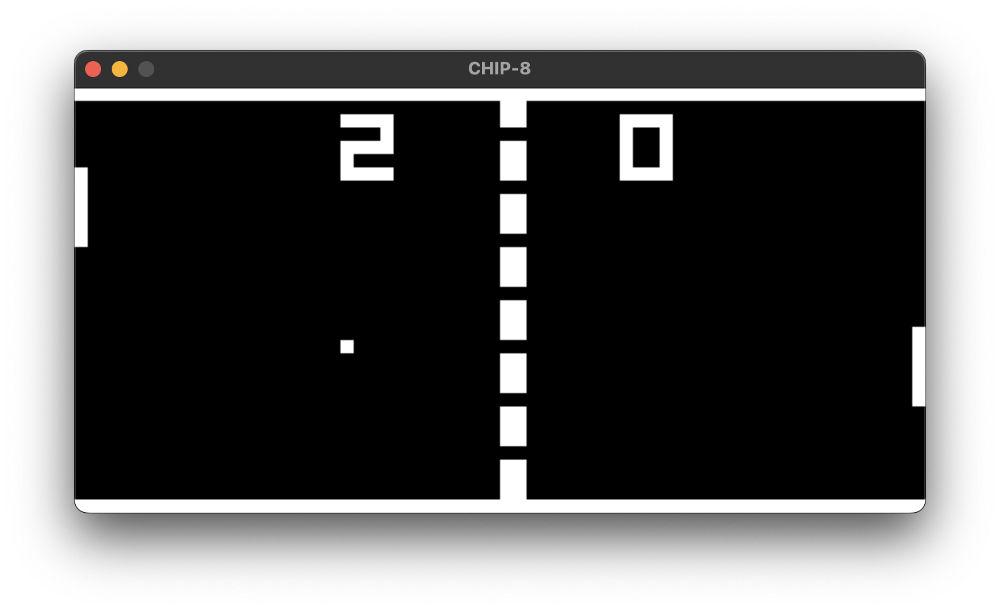

# CHIP-8 Interpreter

[CHIP-8](https://en.wikipedia.org/wiki/CHIP-8) is a virtual machine/fantasy game
console originally developed by Joseph Weisbecker in 1977 for the COSMAC VIP
microcomputer.



This repo contains a C++/SDL3 implementation of the CHIP-8 interpreter designed
to run games and programs written for the original virtual machine/console.
Strictly speaking, it is not technically an "emulator" (since there is no actual
hardware to emulate); however, since it shares many characteristics with modern
software emulators, this document uses the terms "interpreter" and "emulator"
interchangeably.

## Dependencies

This project uses [SDL3](https://github.com/libsdl-org/SDL) for input polling,
window management, and graphics rendering. Dependencies are managed
automatically via CMake's `FetchContent` module, so no separate installation is
required.

## Getting started

To build and run this application:

```sh
$ git clone https://github.com/mattmuroya/chip-8-interpreter.git
$ cd chip-8-interpreter
$ mkdir build
$ cd build
$ cmake ..
$ make
$ ./chip8
```

## Emulator architecture

Conceptually, this project is separated into two primary components:

- The emulator "core", represented by the `Chip8` class, that encapsulates
  application state and logic for individual operations across its component
  subsystems (`Cpu`, `Memory`, and `Display`). This includes isolated actions
  such as loading data into memory, executing a single CPU cycle, and updating
  the display buffer.
- The main orchestration loop that interfaces with the host system I/O and
  drives execution of the emulator core, handling input events, clock cycle
  timing, and refresh rates.

This separation of concerns allows for hardware/platform flexibility independent
of the logical implementation of the emulator core. You could, for example, swap
out SDL3 for other libraries (such as OpenGL/GLFW) or even port to other
platforms (like mobile or web).
